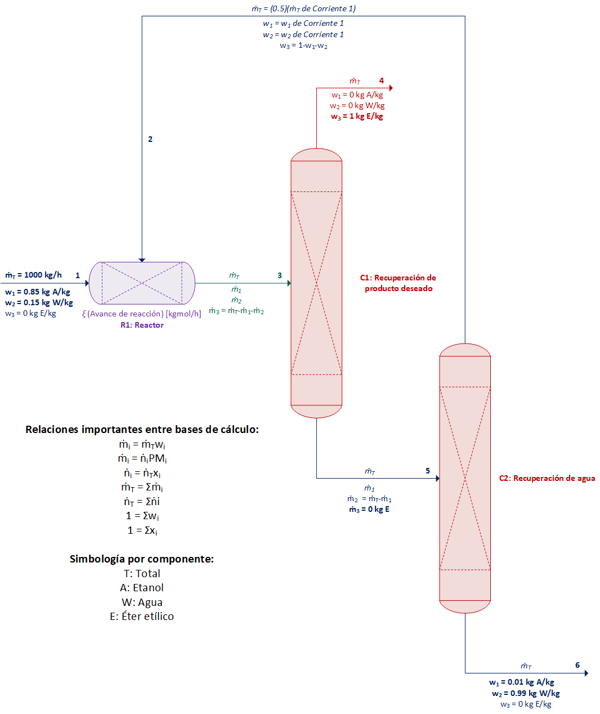
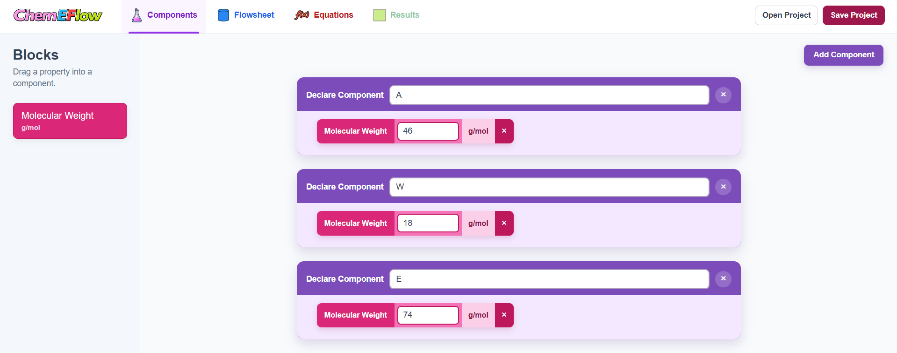
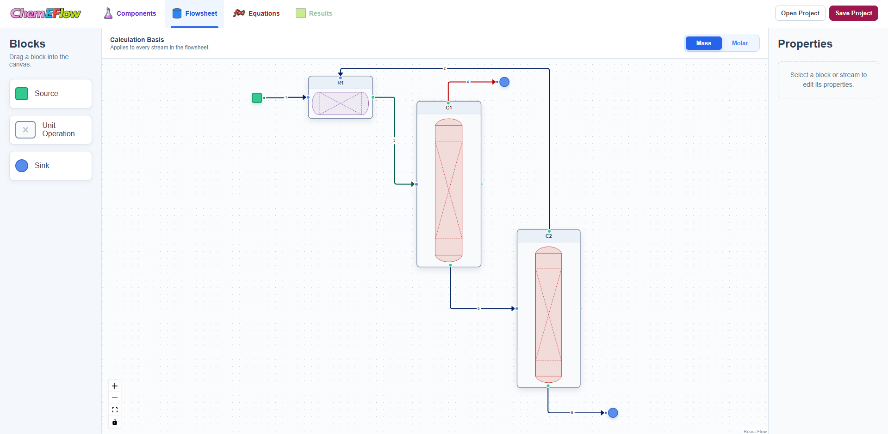
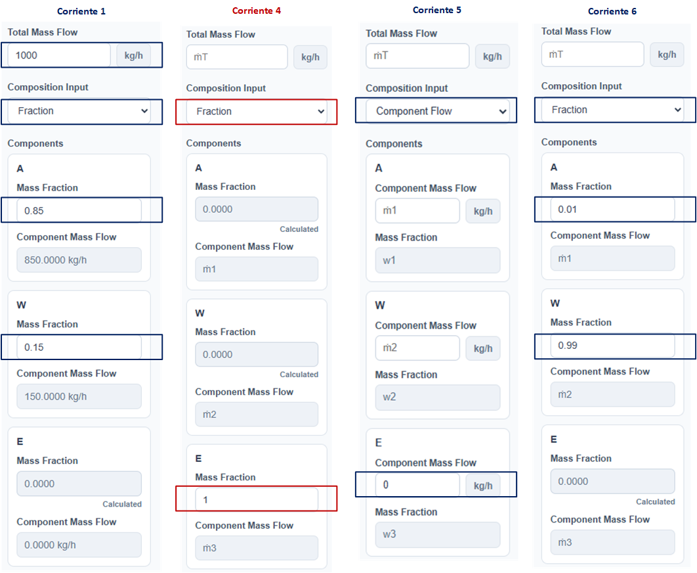
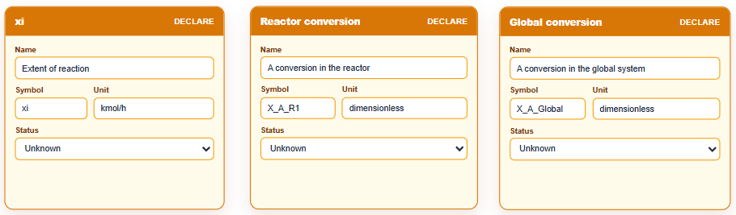
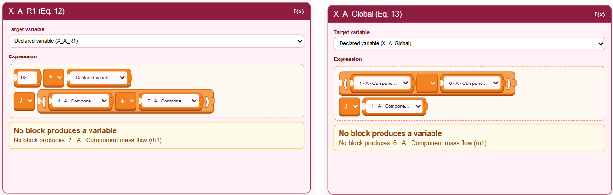
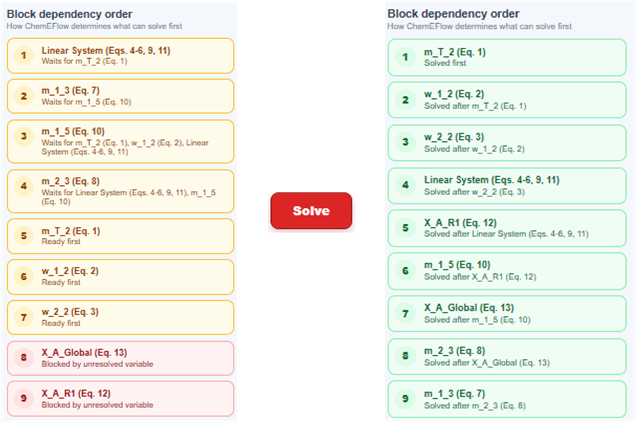
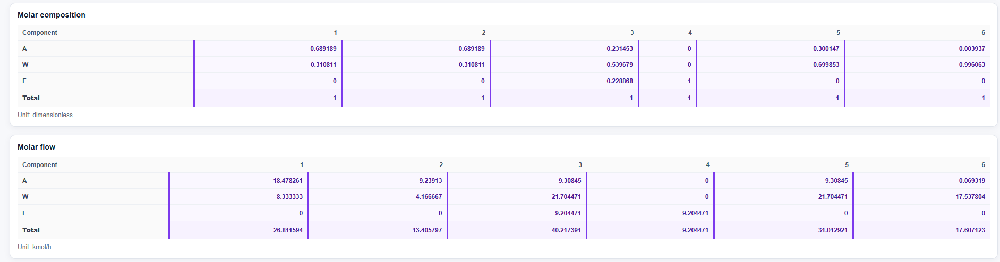
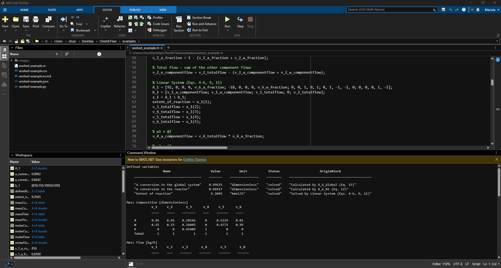

# Resolución guiada en ChemEFlow de un proceso de producción de éter etílico con recirculación

[English version](worked-example.md)

[Simulación](worked-example.json)

[Archivo csv generado](worked-example.csv)

[Código Python generado](worked-example.py)

[Código MATLAB generado](worked_example.m)

## Descripción del problema

**Adaptado del problema 3.15 de Balances de materia y energía, por G. V. Reklaitis y D. R. Schneider, 1986, Nueva Editorial Interamericana. Traducción de J. L. Torres Vázquez.**

El éter etílico ($\mathrm{(C_2H_5)_2O}$ con peso molecular de 74 g/mol) se produce mediante la deshidratación catalítica del etanol:

$$
\mathrm{2C_2H_5OH \longrightarrow (C_2H_5)_2O + H_2O}.
$$

Una corriente fresca de 1000 kg/h contiene 85% en masa de etanol ($\mathrm{C_2H_5OH}$ con peso molecular de 46 g/mol) y 15% en masa de agua ($\mathrm{H_2O}$ con peso molecular de 18 g/mol). La corriente de etanol recirculado representa la mitad de la alimentación fresca y tiene la misma composición. La corriente final rica en agua contiene 1% en masa de etanol.

1. Presenta el diagrama de flujo del proceso con corrientes, equipos y todos los datos e incógnitas.
2. Presenta explícitamente los cálculos relevantes para la determinación de los grados de libertad de todos los equipos y sistema global. ¿Qué puedes concluir?
3. Calcula los flujos y composiciones de todas las corrientes del sistema. Presenta los resultados en tablas con todas las corrientes y todos los compuestos (base másica y molar).
4. Calcula la conversión del reactor y la conversión para el proceso.

## Solución

Las dos primeras partes deben desarrollarse independientemente de ChemEFlow, ya que corresponden al planteamiento del problema y a la definición de la estrategia de solución. Identificar corrientes, equipos, datos, incógnitas, balances y grados de libertad constituye una competencia fundamental en la formación del ingeniero químico. ChemEFlow no sustituye este razonamiento ni el aprendizaje de los métodos de cálculo. Lo complementa mediante un entorno visual y estructurado para organizar variables y ecuaciones, analizar dependencias, resolver el modelo y revisar los resultados.

Un estudiante puede formular correctamente el problema y, aun así, encontrar dificultades al resolver sistemas de ecuaciones, gestionar dependencias o implementar el modelo en una herramienta computacional. ChemEFlow ayuda a superar estas barreras sin ocultar la estructura matemática del problema, fortaleciendo la conexión entre el planteamiento de ingeniería, la solución numérica y la programación en Python o MATLAB.

En muchas etapas iniciales de la formación, la dificultad no está únicamente en comprender los balances, sino en traducir correctamente el planteamiento a un sistema computacional resoluble. ChemEFlow acompaña esa transición y, al mismo tiempo, refuerza conceptos como la identificación de variables, los grados de libertad, las dependencias y el orden de solución. Esta conexión es cada vez más importante en ingeniería, donde formular un modelo y llevarlo a una implementación computacional se ha convertido en una competencia fundamental. ChemEFlow busca apoyar ese aprendizaje sin separar el razonamiento de ingeniería de la solución numérica.

### 1. Diagrama de flujo, datos e incógnitas

El primer paso consiste en representar el proceso a partir del enunciado, identificando equipos, corrientes, componentes, datos conocidos e incógnitas. Esta etapa se realiza conceptualmente fuera de la aplicación, ya que corresponde al planteamiento de ingeniería que debe desarrollarse antes de cualquier implementación computacional.

La Figura 1 muestra el diagrama de flujo conceptual del proceso, elaborado a partir de la interpretación del problema. En él se identifican la alimentación fresca, el reactor, la columna de recuperación de éter etílico, la columna de recuperación de etanol y la corriente de recirculación. También se numeran las corrientes y se distinguen los datos conocidos y las principales incógnitas.

**Figura 1. Diagrama conceptual del proceso de producción de éter etílico con recuperación de producto y recirculación de etanol. Se muestran los datos conocidos, las variables desconocidas y las relaciones entre las bases másica y molar.**

Se consideran tres componentes:

- Etanol (A), identificado con el subíndice 1.
- Agua (W), identificada con el subíndice 2.
- Éter etílico (E), identificado con el subíndice 3.

Para cada corriente (la nomenclatura de los primeros seis puntos es la que sigue ChemEFlow):

- $\dot m_T$ representa el flujo másico total.
- $\dot m_i$ representa el flujo másico del componente $i$.
- $\dot n_T$ representa el flujo molar total.
- $\dot n_i$ representa el flujo molar del componente $i$.
- $w_i$ representa la fracción másica del componente $i$.
- $x_i$ representa la fracción molar del componente $i$.
- $PM_i$ representa el peso molecular del componente $i$.
- $\xi$ representa el avance de reacción.

Una vez definido el esquema del proceso, este se adapta a ChemEFlow. Primero se registran los componentes del sistema y sus pesos moleculares. El orden en que se declaran determina la numeración utilizada posteriormente en las corrientes; por tanto, el componente ubicado en la posición $i$ se asocia con las propiedades identificadas mediante el subíndice $i$, como $w_i$ y $\dot m_i$, dentro de la base másica de cálculo seleccionada para la solución del problema.

**Figura 2. Componentes del sistema definidos en ChemEFlow.**

Posteriormente se construye el diagrama de flujo dentro de la aplicación, respetando la estructura conceptual previamente establecida. La Figura 3 muestra el diagrama adaptado en ChemEFlow. Una vez construido el diagrama en ChemEFlow, se configura cada corriente con sus propiedades conocidas (Figura 4). Esta representación conserva la lógica del planteamiento original y sirve como base para asociar corrientes, variables, ecuaciones y relaciones de cálculo dentro de la aplicación. 

**Figura 3. Diagrama de flujo del proceso adaptado en ChemEFlow.**

**Figura 4. Configuración de las corrientes en ChemEFlow con los datos conocidos.**

En la base másica seleccionada, ChemEFlow relaciona el flujo másico total $\dot m_T$, las fracciones másicas $w_i$ y los flujos másicos por componente $\dot m_i$. Cada vez que se proporciona o se calcula la información suficiente, la aplicación determina las propiedades másicas o molares faltantes con las relaciones proporcionadas en la Figura 1. Además, verifica la consistencia de los datos introducidos, comprobando que las fracciones sumen uno, que los valores sean físicamente válidos y que no se contradigan las relaciones entre el flujo total, las composiciones y los flujos por componente. De esta manera, las corrientes no solo representan conexiones gráficas, sino también conjuntos de variables vinculadas mediante relaciones internas.

Igualmente, una vez construido y configurado el diagrama de flujo, en el panel derecho de la pestaña "Equations" de ChemEFlow presenta, de acuerdo con la base de cálculo seleccionada, las variables conocidas introducidas por el usuario, las variables calculadas automáticamente mediante las relaciones mostradas en la Figura 1, las variables que aún permanecen desconocidas y las variables resueltas por los bloques (con su secuencia de solución). Cada vez que se soluciona alguna variable desconocida, el inventario de variables completo se actualiza. Esta pestaña de ChemEFlow también indica qué motor de cálculo se encuentra disponible para analizar y resolver el modelo: el ejecutado en el navegador mediante JavaScript o el backend opcional basado en Python (Figura 5).

**Figura 5. Inventario de variables, secuencia de solución y motor de cálculo disponible en la pestaña Equations de ChemEFlow. En caso de usar el demo, el motor es JavaScript.**

Con la estructura del proceso ya definida tanto conceptualmente como en la aplicación, el siguiente paso consiste en establecer los balances independientes y determinar los grados de libertad de los equipos y del sistema global.

### 2. Análisis de grados de libertad y estrategia de solución

Como el proceso opera de manera continua, en estado estacionario y con una reacción química, la ecuación general de balance para cada componente es:

$$
\text{Entrada}+\text{Generación}-\text{Salida}-\text{Consumo}
=\cancel{\text{Acumulación}}.
$$

Debido al estado estacionario, la acumulación es igual a cero. Por tanto, para los reactivos:

$$
\text{Entrada}=\text{Salida}+\text{Consumo},
$$

y para los productos:

$$
\text{Entrada}+\text{Generación}=\text{Salida}.
$$

En las columnas de separación no ocurre reacción química, por lo que los términos de generación y consumo son nulos:

$$
\text{Entrada}=\text{Salida}.
$$

Para representar la reacción se utiliza el avance de reacción $\xi$, expresado en $\mathrm{kmol/h}$. Por cada unidad de avance de reacción se consumen $2\ \mathrm{kmol}$ de etanol y se generan $1\ \mathrm{kmol}$ de agua y $1\ \mathrm{kmol}$ de éter etílico. En base másica, estos términos se obtienen multiplicando los coeficientes estequiométricos por los pesos moleculares correspondientes:

$$
\text{Etanol consumido}=2PM_1\xi,
$$

$$
\text{Agua generada}=PM_2\xi,
$$

$$
\text{Éter generado}=PM_3\xi,
$$

donde:

$$
PM_1=46\ \mathrm{kg/kmol},\qquad
PM_2=18\ \mathrm{kg/kmol},\qquad
PM_3=74\ \mathrm{kg/kmol}.
$$

Las relaciones existentes entre la corriente 1 y 2 son (primera parte del subíndice corresponde al componente y la segunda a la corriente):

$$
\dot m_{T,2}=0.5\dot m_{T,1},
\tag{1}
$$
$$
w_{1,2}=w_{1,1},
\tag{2}
$$
$$
w_{2,2}=w_{2,1}.
\tag{3}
$$
El grado de libertad de cada subsistema se determina mediante:

$$
GL=\#\text{ Incógnitas}-\#\text{ Ecuaciones Independientes}.
$$

Las ecuaciones planteadas como balances tendrán unidades de kg/h.

#### Sistema Global

Para el balance global, la corriente de recirculación es interna y no cruza la frontera del sistema. Por tanto, únicamente entra la corriente fresca 1 y salen la corriente de producto 4 y la corriente final rica en agua 6.

Las incógnitas son $\left\{\dot m_{T,4},\dot m_{T,6},\xi\right\}$. Se pueden formular tres balances independientes:

**Balance de etanol:** $\dot m_{T,1}w_{1,1}=\dot m_{T,6}w_{1,6}+2PM_1\xi$ $\Rightarrow$ $(1000)(0.85)=\dot m_{T,6}(0.01)+2(46)\xi$ 

$$
\Rightarrow 850=0.01\dot m_{T,6}+92\xi.
\tag{4}
$$

**Balance de agua:** $\dot m_{T,1}w_{2,1}=\dot m_{T,6}w_{2,6}-PM_2\xi$ $\Rightarrow$ $(1000)(0.15)=\dot m_{T,6}(0.99)-18\xi$ 

$$
\Rightarrow 150=0.99\dot m_{T,6}-18\xi.
\tag{5}
$$

**Balance de total:** $\dot m_{T,1}=\dot m_{T,6}+\dot m_{T,4}$  

$$
\Rightarrow 1000=\dot m_{T,6}+\dot m_{T,4}.
\tag{6}
$$

Por tanto, $GL_{\text{Global}}=3-3=0$. El sistema global está correctamente especificado y puede resolverse independientemente para determinar sus incógnitas.

#### Reactor (R1)

Al reactor entran las corrientes 1 y 2, mientras que la corriente 3 constituye su salida.

Las incógnitas son $\left\{\dot m_{T,2}, w_{1,2}, w_{2,2}, \dot m_{T,3}, \dot m_{1,3}, \dot m_{2,3}, \xi\right\}$. Se pueden formular tres balances independientes:

**Balance de etanol:** $\dot m_{T,1}w_{1,1} + \dot m_{T,2}w_{1,2}=\dot m_{1,3}+2PM_1\xi$ $\Rightarrow$ $(1000)(0.85) + m_{T,2}w_{1,2} = \dot m_{1,3}+2(46)\xi$ 

$$
\Rightarrow 850 + m_{T,2}w_{1,2} = \dot m_{1,3}+92\xi.
$$

**Balance de agua:** $\dot m_{T,1}w_{2,1} + \dot m_{T,2}w_{2,2}=\dot m_{2,3}-PM_2\xi$ $\Rightarrow$ $(1000)(0.15) + m_{T,2}w_{2,2} = \dot m_{2,3}-18\xi$ 

$$
\Rightarrow 150 + m_{T,2}w_{2,2} = \dot m_{2,3}-18\xi.
$$

**Balance de total:** $\dot m_{T,1} + \dot m_{T,2} = \dot m_{T,3}$  

$$
\Rightarrow 1000 + \dot m_{T,2} =\dot m_{T,3}.
$$

Por tanto, $GL_{\text{R1}}=7-3=4$. El reactor no puede resolverse de manera independiente porque requiere conocer cuatro de sus incógnitas. Por ejemplo, si se determinan $m_{T,2}, w_{1,2}, w_{2,2}, \xi$ resolviendo el sistema de Ecuaciones (1)-(6), el reactor tendrá $GL=0$ para poder resolverse.

#### Columna de recuperación de producto deseado (C1)

En la primera columna entra la corriente 3 y salen la corriente 4, formada por éter etílico puro, y la corriente 5, que contiene etanol y agua.

Las incógnitas son $\left\{m_{T,3}, \dot m_{1,3}, \dot m_{2,3}, \dot m_{T,4}, \dot m_{T,5}, \dot m_{1,5}\right\}$. Se pueden formular tres balances independientes:

**Balance de etanol:**

$$
\dot m_{1,3}=\dot m_{1,5}.
\tag{7}
$$

**Balance de agua:**

$$
\dot m_{2,3}=\dot m_{T,5}-\dot m_{1,5}.
\tag{8}
$$

**Balance de total:** 

$$
\dot m_{T,3}=\dot m_{T,4}+\dot m_{T,5}.
\tag{9}
$$

Por tanto, $GL_{\text{C1}}=6-3=3$. C1 no puede resolverse de manera independiente porque requiere conocer tres de sus incógnitas. Por ejemplo, si se determinan $\dot m_{T,3}, \dot m_{1,3}, \dot m_{2,3}$ en el reactor, C1 tendrá $GL=0$ para poder resolverse.

#### Columna de recuperación de agua (C2)

En la segunda columna entra la corriente 5 y salen la corriente de recirculación 2 y la corriente final rica en agua 6.

Las incógnitas son $\left\{\dot m_{T,5}, \dot m_{1,5}, \dot m_{T,2}, w_{1,2}, \dot m_{T,6}\right\}$. Se pueden formular dos balances independientes:

**Balance de etanol:** $\dot m_{1,5}=\dot m_{T,2}w_{1,2}+\dot m_{T,6}w_{1,6}$

$$
\Rightarrow \dot m_{1,5}=\dot m_{T,2}w_{1,2}+0.01\dot m_{T,6}.
\tag{10}
$$

**Balance de total:** 

$$
\dot m_{T,5}=\dot m_{T,2}+\dot m_{T,6}.
\tag{11}
$$ 

Por tanto, $GL_{\text{C2}}=5-2=3$. C2 no puede resolverse de manera independiente porque requiere conocer tres de sus incógnitas. Por ejemplo, si se determinan $\dot m_{T,2}, w_{1,2}, \dot m_{T,6}$ con las Ecuaciones (1)-(3) y el sistema global, C2 tendrá $GL=0$ para poder resolverse.

Asimismo, la conversión de etanol (cantidad consumida/cantidad alimentada) en el reactor y global se calculan como:

$$
X_{A,R1}=\dfrac{2PM_1\xi}{\dot m_{1,1}+\dot m_{1,2}} = \dfrac{92\xi}{\dot m_{1,1}+\dot m_{1,2}},
\tag{12}
$$

$$
X_{A,Global}=\dfrac{\dot m_{1,1}-\dot m_{1,6}}{\dot m_{1,1}},
\tag{13}
$$

respectivamente.

Cabe señalar que los balances de materia pueden formularse mediante diferentes conjuntos de ecuaciones equivalentes. Por ejemplo, en un subsistema pueden utilizarse todos los balances de componente, o sustituir uno de ellos por el balance total, siempre que las ecuaciones seleccionadas sean independientes y contengan la misma información física. De manera similar, el problema puede plantearse en base másica o molar. Ambas formulaciones conducen a la misma solución cuando se aplican correctamente la estequiometría, los pesos moleculares y las relaciones entre composiciones y flujos. Por tanto, el análisis de grados de libertad no establece una única secuencia obligatoria de cálculo. Su función es determinar si un subsistema puede resolverse con la información disponible, identificar qué variables adicionales necesita y revelar las dependencias existentes entre los equipos.

#### Estrategia de solución

El análisis de grados de libertad muestra que las Ecuaciones (1)-(3) y el Sistema Global constituyen el punto de partida más conveniente, ya que tienen solución dada su expresión explícita o al comprobarse grados de libertad igual a cero. En el diagrama de flujo y análisis de grados de libertad hay 11 incógnitas $\left\{\xi, w_{1,2}, w_{2,2}, \dot m_{T,2}, \dot m_{1,3}, \dot m_{2,3}, \dot m_{T,3}, \dot m_{T,4}, \dot m_{1,5}, \dot m_{T,5}, \dot m_{T,6}\right\}$, donde las Ecuaciones (1)-(11) establecen esta posible estrategia de solución: obtener directamente los valores de $w_{1,2}, w_{2,2}, \dot m_{T,2}$ con las Ecuaciones (1)-(3) y dichos resultados complementan el sistema de ecuaciones lineales que establecen las Ecuaciones (4)-(6), (9) y (11):

$$
\begin{bmatrix}
92 & 0 & 0 & 0 & w_{1,6} \\
-18 & 0 & 0 & 0 & w_{2,6} \\
0 & 0 & 1 & 0 & 1 \\
0 & 1 & -1 & -1 & 0 \\
0 & 0 & 0 & 1 & -1
\end{bmatrix}
\begin{bmatrix}
\xi\\
\dot m_{T,3}\\
\dot m_{T,4}\\
\dot m_{T,5}\\
\dot m_{T,6}
\end{bmatrix}
=
\begin{bmatrix}
\dot m_{T,1}w_{1,1}=\dot m_{1,1}\\
\dot m_{T,1}w_{2,1}=\dot m_{2,1}\\
\dot m_{T,1}\\
0\\
\dot m_{T,2}
\end{bmatrix},
\tag{14}
$$

y usar dichos valores calculados en las Ecuaciones (10), (8) y (7). 

En este problema se especifican $\dot m_{T,1}=1000\ \mathrm{kg/h}$, $w_{1,1}=0.85$, $w_{2,1}=0.15$, $w_{1,6}=0.01$ y $w_{2,6}=0.99$. Esta formulación resulta especialmente útil porque estos datos definen por completo las condiciones de las corrientes 1 y 6 y, con ello, el problema que debe resolverse. Al modificar únicamente estos valores, pueden generarse variantes con la misma estructura y nivel de dificultad, pero con resultados numéricos diferentes. Esto permite a los profesores proponer ejercicios equivalentes y reducir la reproducción directa de soluciones, mientras que los estudiantes pueden comparar distintos casos o realizar análisis de sensibilidad para estudiar cómo responde el sistema ante cambios en el flujo de alimentación y en las composiciones especificadas.

Esta secuencia no representa la única formulación posible, pero resulta conveniente porque inicia con los subsistemas completamente especificados y utiliza sus resultados para resolver los bloques dependientes. Finalmente, las conversiones solicitadas se calculan mediante las Ecuaciones (12) y (13). La misma lógica se representa en ChemEFlow mediante declaraciones de variables, sistemas de ecuaciones y funciones objetivo conectadas por dependencias, como se muestra en las Figuras 6–10. 

**Figura 6. Declaración de variables.**

**Figura 7. Funciones objetivo mediante las Ecuaciones (1)-(3).**

**Figura 8. Sistema lineal de Ecuaciones (4)-(6), (9) y (11).**

**Figura 9. Funciones objetivo mediante las Ecuaciones (10), (8) y (7).**

**Figura 10. Funciones objetivo mediante las Ecuaciones (12)-(13).**

Esta etapa también tiene un propósito formativo: adaptar una solución conceptual a un entorno computacional exige traducir correctamente el problema a variables, ecuaciones, bloques y relaciones de dependencia. Esta traducción no es un paso automático ni meramente operativo; constituye una evidencia de comprensión del modelo. Aprender a realizarla permite a los estudiantes utilizar simuladores y herramientas de cálculo de manera crítica, aprovechar la reducción del trabajo algebraico y dedicar mayor atención al análisis, la verificación y la interpretación de los resultados.

### 3. y 4. Resultados

Cuando se insertan los bloques en la pestaña "Equations", el modelo puede resolverse de manera parcial o total cada vez que se selecciona el botón "Solve", actualizando automáticamente el inventario de variables. Después de configurar los bloques mostrados en las Figuras 6–10 y ejecutar nuevamente Solve, se completa la solución del modelo y todos los valores determinados se presentan en la pestaña "Results" (Figuras 11-13).

**Figura 11. Dependencias de los bloques antes y después de "Solve".**

**Figura 12. Resultados de variables declaradas, flujos y composiciones másicas.**

**Figura 13. Resultados de flujos y composiciones molares.**

Más allá de obtener los resultados numéricos, esta etapa permite observar cómo cada ecuación aporta información al sistema y cómo una variable resuelta puede habilitar el cálculo de otras variables dependientes. De esta manera, el estudiante no solo verifica la respuesta final, sino también la secuencia lógica de solución, la consistencia de los balances y la relación entre el planteamiento conceptual y su implementación computacional.

El uso de ChemEFlow permite reducir el trabajo algebraico repetitivo, pero no elimina la necesidad de comprender el problema. Para construir correctamente el modelo es necesario identificar las variables, seleccionar ecuaciones independientes y establecer sus dependencias. Por ello, la aplicación funciona como una herramienta de apoyo para comprobar y explorar la solución, no como un sustituto del razonamiento de ingeniería.

De la misma forma, en la pestaña de "Results" se encuentran los botones para exportar el cálculo y obtención de resultados a csv, código Python o código MATLAB (Figuras 14-16). Igualmente, se cuentan con las opciones de guardar (botón "Save Project") y abrir una simulación previamente guardada (botón "Open Project").

**Figura 14. Resultados en archivo csv.**

**Figura 15. Código en Python.**

**Figura 16. Código en MATLAB.**

## Conclusión

ChemEFlow permite representar y resolver de manera estructurada un problema de balances de materia con reacción, separación y recirculación. El flujo de trabajo conecta:

diagrama
→ variables
→ grados de libertad
→ ecuaciones
→ dependencias
→ análisis
→ solución
→ resultados
→ exportación

De esta manera, el estudiante puede observar cómo se formula el modelo, cómo se determina el orden de solución y cómo los resultados pueden trasladarse posteriormente a Python o MATLAB.