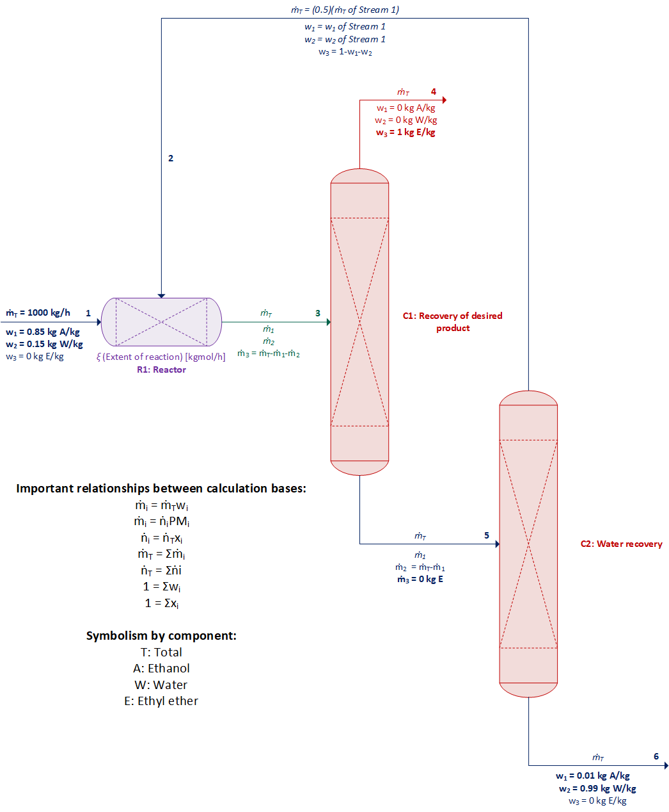
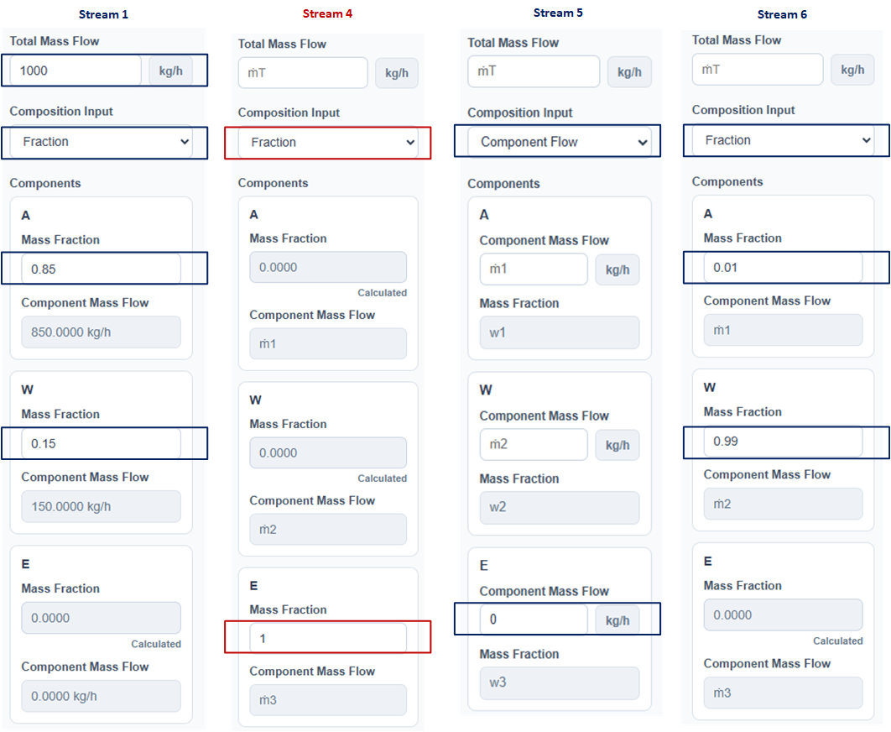
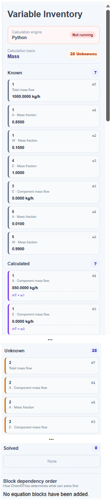
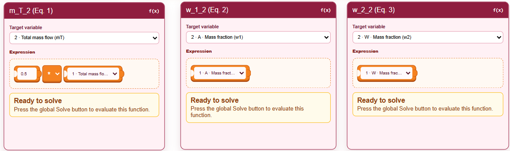
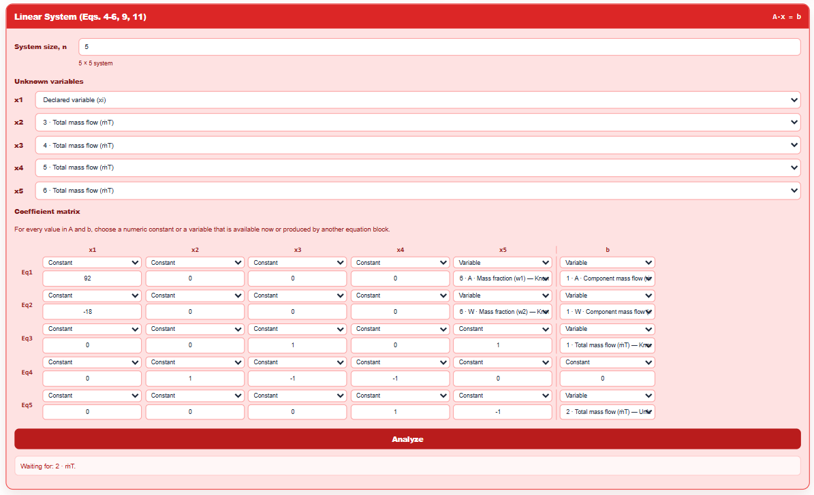
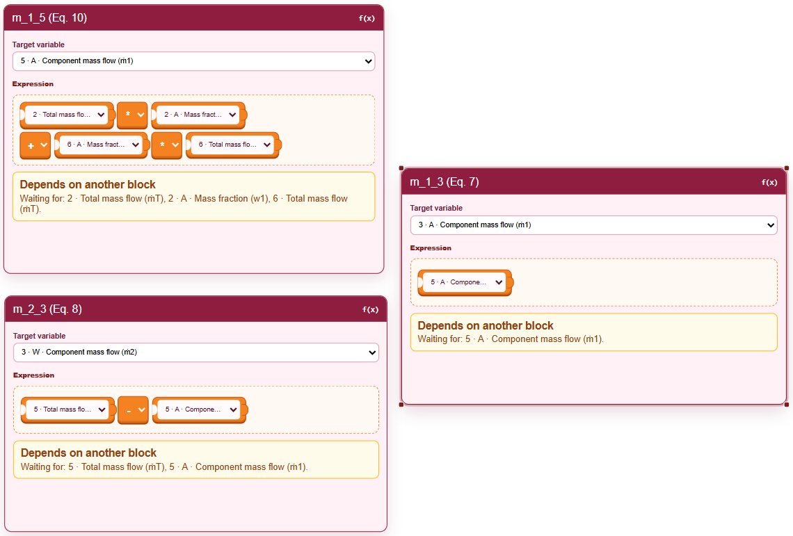
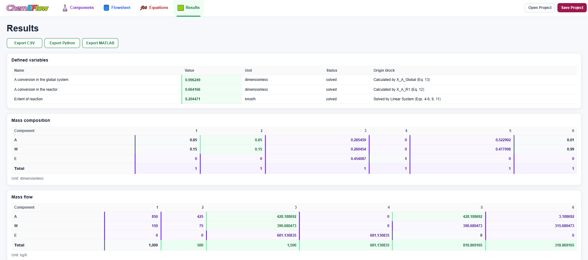
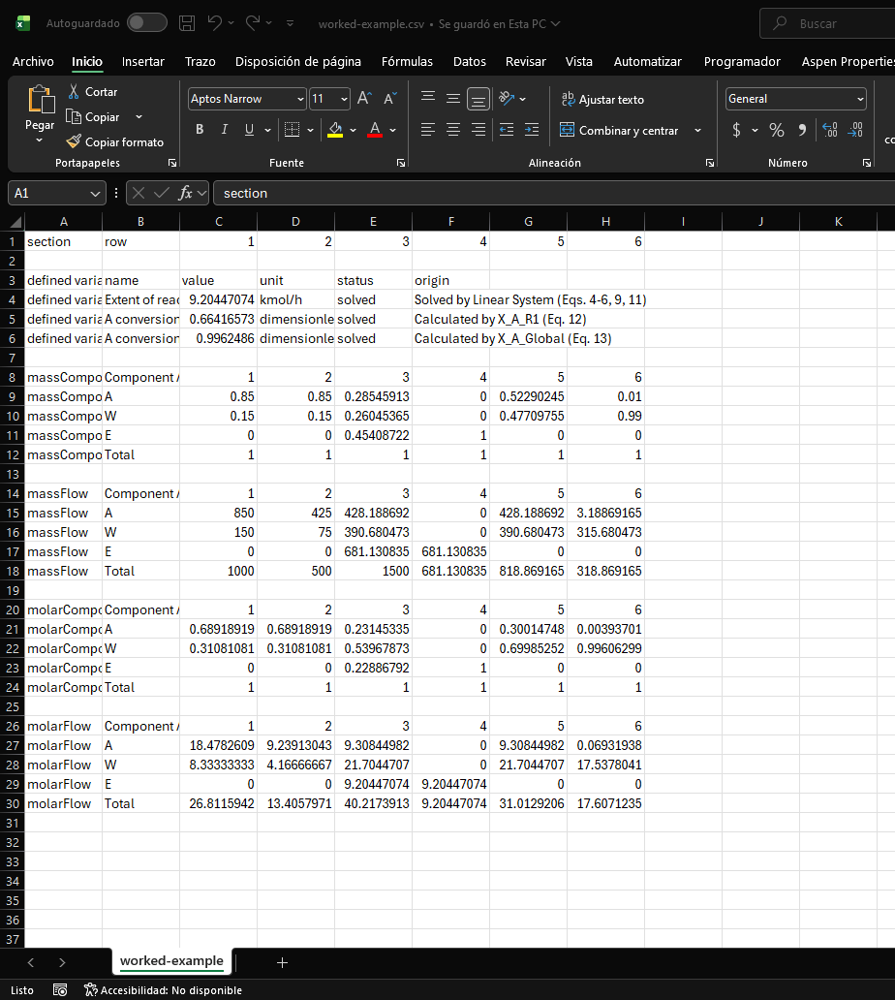
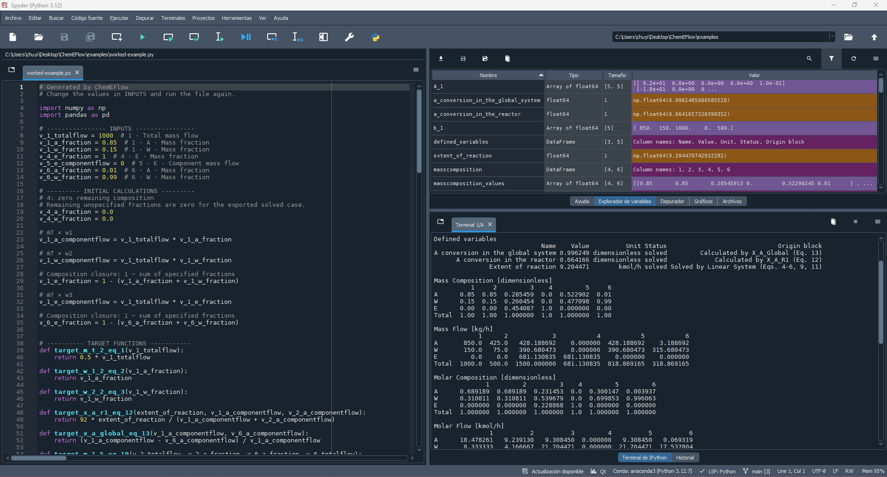

# Guided resolution in ChemEFlow of an ethyl ether production process with recycle

[Versión en español](worked-example.es.md)

[Simulation](worked-example.json)

[Generated csv file](worked-example.csv)

[Generated Python code](worked-example.py)

[Generated MATLAB code](worked_example.m)

## Problem description

**Adapted from Problem 3.15 of Material and Energy Balances, by G. V. Reklaitis and D. R. Schneider, 1986, Nueva Editorial Interamericana. Translation by J. L. Torres Vázquez.**

Ethyl ether ($\mathrm{(C_2H_5)_2O}$ with a molecular weight of 74 g/mol) is produced by the catalytic dehydration of ethanol:

$$
\mathrm{2C_2H_5OH \longrightarrow (C_2H_5)_2O + H_2O}.
$$

A fresh stream of 1000 kg/h contains 85% ethanol by mass ($\mathrm{C_2H_5OH}$ with a molecular weight of 46 g/mol) and 15% water by mass ($\mathrm{H_2O}$ with a molecular weight of 18 g/mol). The recycled ethanol stream represents half of the fresh feed and has the same composition. The final water-rich stream contains 1% ethanol by mass.

1. Present the process flowsheet with streams, equipment, and all known data and unknowns.
2. Explicitly present the relevant calculations for determining the degrees of freedom of all equipment and the overall system. What can you conclude?
3. Calculate the flow rates and compositions of all streams in the system. Present the results in tables containing all streams and all compounds (mass and molar basis).
4. Calculate the reactor conversion and the overall process conversion.

## Solution

The first two parts must be developed independently of ChemEFlow because they correspond to formulating the problem and defining the solution strategy. Identifying streams, equipment, known data, unknowns, balances, and degrees of freedom is a fundamental competency in chemical engineering education. ChemEFlow does not replace this reasoning or the learning of calculation methods. It complements them through a visual and structured environment for organizing variables and equations, analyzing dependencies, solving the model, and reviewing the results.

A student may formulate the problem correctly and still encounter difficulties when solving systems of equations, managing dependencies, or implementing the model in a computational tool. ChemEFlow helps overcome these barriers without hiding the mathematical structure of the problem, strengthening the connection between engineering formulation, numerical solution, and programming in Python or MATLAB.

At many early stages of education, the difficulty lies not only in understanding the balances but also in correctly translating the formulation into a computationally solvable system. ChemEFlow supports this transition while reinforcing concepts such as variable identification, degrees of freedom, dependencies, and solution order. This connection is increasingly important in engineering, where formulating a model and implementing it computationally has become a fundamental competency. ChemEFlow seeks to support this learning without separating engineering reasoning from numerical solution.

### 1. Flowsheet, known data, and unknowns

The first step is to represent the process from the problem statement by identifying equipment, streams, components, known data, and unknowns. This stage is performed conceptually outside the application because it corresponds to the engineering formulation that must be developed before any computational implementation.

Figure 1 shows the conceptual process flowsheet developed from the interpretation of the problem. It identifies the fresh feed, reactor, ethyl ether recovery column, ethanol recovery column, and recycle stream. The streams are also numbered, and the known data and main unknowns are distinguished.

**Figure 1. Conceptual flowsheet of the ethyl ether production process with product recovery and ethanol recycle. The known data, unknown variables, and relationships between mass and molar bases are shown.**

Three components are considered:

- Ethanol (A), identified with subscript 1.
- Water (W), identified with subscript 2.
- Ethyl ether (E), identified with subscript 3.

For each stream (the nomenclature of the first six items is the one followed by ChemEFlow):

- $\dot m_T$ represents the total mass flow rate.
- $\dot m_i$ represents the mass flow rate of component $i$.
- $\dot n_T$ represents the total molar flow rate.
- $\dot n_i$ represents the molar flow rate of component $i$.
- $w_i$ represents the mass fraction of component $i$.
- $x_i$ represents the mole fraction of component $i$.
- $PM_i$ represents the molecular weight of component $i$.
- $\xi$ represents the extent of reaction.

Once the process scheme has been defined, it is adapted to ChemEFlow. First, the system components and their molecular weights are registered. The order in which they are declared determines the numbering subsequently used in the streams; therefore, the component located in position $i$ is associated with the properties identified by subscript $i$, such as $w_i$ and $\dot m_i$, within the mass calculation basis selected for solving the problem.

**Figure 2. System components defined in ChemEFlow.**

The flowsheet is then constructed within the application while respecting the previously established conceptual structure. Figure 3 shows the flowsheet adapted in ChemEFlow. Once the flowsheet has been constructed in ChemEFlow, each stream is configured with its known properties (Figure 4). This representation preserves the logic of the original formulation and serves as the basis for associating streams, variables, equations, and calculation relationships within the application. 

**Figure 3. Process flowsheet adapted in ChemEFlow.**

**Figure 4. Stream configuration in ChemEFlow with the known data.**

On the selected mass basis, ChemEFlow relates the total mass flow rate $\dot m_T$, the mass fractions $w_i$, and the component mass flow rates $\dot m_i$. Whenever sufficient information is provided or calculated, the application determines the missing mass or molar properties using the relationships provided in Figure 1. It also verifies the consistency of the entered data by checking that the fractions sum to one, that the values are physically valid, and that the relationships among the total flow rate, compositions, and component flow rates are not contradicted. In this way, the streams represent not only graphical connections but also sets of variables linked through internal relationships.

Likewise, once the flowsheet has been constructed and configured, the right panel of the ChemEFlow "Equations" tab presents, according to the selected calculation basis, the known variables entered by the user, the variables calculated automatically through the relationships shown in Figure 1, the variables that remain unknown, and the variables solved by the blocks (with their solution sequence). Each time an unknown variable is solved, the complete variable inventory is updated. This ChemEFlow tab also indicates which calculation engine is available to analyze and solve the model: the one executed in the browser through JavaScript or the optional Python-based backend (Figure 5).

**Figure 5. Variable inventory, solution sequence, and calculation engine available in the ChemEFlow Equations tab. When using the demo, the engine is JavaScript.**

With the process structure already defined both conceptually and in the application, the next step is to establish the independent balances and determine the degrees of freedom of the equipment and the overall system.

### 2. Degrees-of-freedom analysis and solution strategy

Because the process operates continuously, at steady state, and with a chemical reaction, the general balance equation for each component is:

$$
\text{Input}+\text{Generation}-\text{Output}-\text{Consumption}
=\text{Accumulation}.
$$

Because the system is at steady state, accumulation is equal to zero. Therefore, for reactants:

$$
\text{Input}=\text{Output}+\text{Consumption},
$$

and for products:

$$
\text{Input}+\text{Generation}=\text{Output}.
$$

No chemical reaction occurs in the separation columns, so the generation and consumption terms are zero:

$$
\text{Input}=\text{Output}.
$$

The extent of reaction $\xi$, expressed in $\mathrm{kmol/h}$, is used to represent the reaction. For each unit of reaction extent, $2\ \mathrm{kmol}$ of ethanol are consumed and $1\ \mathrm{kmol}$ of water and $1\ \mathrm{kmol}$ of ethyl ether are generated. On a mass basis, these terms are obtained by multiplying the stoichiometric coefficients by the corresponding molecular weights:

$$
\text{Ethanol consumed}=2PM_1\xi,
$$

$$
\text{Water generated}=PM_2\xi,
$$

$$
\text{Ether generated}=PM_3\xi,
$$

where:

$$
PM_1=46\ \mathrm{kg/kmol},\qquad
PM_2=18\ \mathrm{kg/kmol},\qquad
PM_3=74\ \mathrm{kg/kmol}.
$$

The relationships between streams 1 and 2 are (the first part of the subscript corresponds to the component and the second to the stream):

$$
\dot m_{T,2}=0.5\dot m_{T,1},
$$

<strong>(1)</strong>

$$
w_{1,2}=w_{1,1},
$$

<strong>(2)</strong>

$$
w_{2,2}=w_{2,1}.
$$

<strong>(3)</strong>

The degree of freedom of each subsystem is determined by:

$$
GL=N_{\text{Unknowns}}-N_{\text{Independent Equations}}.
$$

The equations formulated as balances have units of kg/h.

#### Overall System

For the overall balance, the recycle stream is internal and does not cross the system boundary. Therefore, only fresh stream 1 enters, while product stream 4 and the final water-rich stream 6 leave.

The unknowns are $\dot m_{T,4},\dot m_{T,6},\xi$. Three independent balances can be formulated:

**Ethanol balance:** $\dot m_{T,1}w_{1,1}=\dot m_{T,6}w_{1,6}+2PM_1\xi$ $\Rightarrow$ $(1000)(0.85)=\dot m_{T,6}(0.01)+2(46)\xi$ 

$$
\Rightarrow 850=0.01\dot m_{T,6}+92\xi.
$$

<strong>(4)</strong>

**Water balance:** $\dot m_{T,1}w_{2,1}=\dot m_{T,6}w_{2,6}-PM_2\xi$ $\Rightarrow$ $(1000)(0.15)=\dot m_{T,6}(0.99)-18\xi$ 

$$
\Rightarrow 150=0.99\dot m_{T,6}-18\xi.
$$

<strong>(5)</strong>

**Total balance:** $\dot m_{T,1}=\dot m_{T,6}+\dot m_{T,4}$  

$$
\Rightarrow 1000=\dot m_{T,6}+\dot m_{T,4}.
$$

<strong>(6)</strong>

Therefore, $GL_{\text{Global}}=3-3=0$. The overall system is correctly specified and can be solved independently to determine its unknowns.

#### Reactor (R1)

Streams 1 and 2 enter the reactor, while stream 3 is its outlet.

The unknowns are $\dot m_{T,2}, w_{1,2}, w_{2,2}, \dot m_{T,3}, \dot m_{1,3}, \dot m_{2,3}, \xi$. Three independent balances can be formulated:

**Ethanol balance:** $\dot m_{T,1}w_{1,1} + \dot m_{T,2}w_{1,2}=\dot m_{1,3}+2PM_1\xi$ $\Rightarrow$ $(1000)(0.85) + m_{T,2}w_{1,2} = \dot m_{1,3}+2(46)\xi$ 

$$
\Rightarrow 850 + m_{T,2}w_{1,2} = \dot m_{1,3}+92\xi.
$$

**Water balance:** $\dot m_{T,1}w_{2,1} + \dot m_{T,2}w_{2,2}=\dot m_{2,3}-PM_2\xi$ $\Rightarrow$ $(1000)(0.15) + m_{T,2}w_{2,2} = \dot m_{2,3}-18\xi$ 

$$
\Rightarrow 150 + m_{T,2}w_{2,2} = \dot m_{2,3}-18\xi.
$$

**Total balance:** $\dot m_{T,1} + \dot m_{T,2} = \dot m_{T,3}$  

$$
\Rightarrow 1000 + \dot m_{T,2} =\dot m_{T,3}.
$$

Therefore, $GL_{\text{R1}}=7-3=4$. The reactor cannot be solved independently because four of its unknowns must be known. For example, if $m_{T,2}, w_{1,2}, w_{2,2}, \xi$ are determined by solving Equations (1)-(6), the reactor will have $GL=0$ and can be solved.

#### Desired product recovery column (C1)

Stream 3 enters the first column, while stream 4, consisting of pure ethyl ether, and stream 5, containing ethanol and water, leave it.

The unknowns are $\dot m_{T,3}, \dot m_{1,3}, \dot m_{2,3}, \dot m_{T,4}, \dot m_{T,5}, \dot m_{1,5}$. Three independent balances can be formulated:

**Ethanol balance:**

$$
\dot m_{1,3}=\dot m_{1,5}.
$$

<strong>(7)</strong>

**Water balance:**

$$
\dot m_{2,3}=\dot m_{T,5}-\dot m_{1,5}.
$$

<strong>(8)</strong>

**Total balance:** 

$$
\dot m_{T,3}=\dot m_{T,4}+\dot m_{T,5}.
$$

<strong>(9)</strong>

Therefore, $GL_{\text{C1}}=6-3=3$. C1 cannot be solved independently because three of its unknowns must be known. For example, if $\dot m_{T,3}, \dot m_{1,3}, \dot m_{2,3}$ are determined in the reactor, C1 will have $GL=0$ and can be solved.

#### Water recovery column (C2)

Stream 5 enters the second column, while recycle stream 2 and the final water-rich stream 6 leave it.

The unknowns are $\dot m_{T,5}, \dot m_{1,5}, \dot m_{T,2}, w_{1,2}, \dot m_{T,6}$. Two independent balances can be formulated:

**Ethanol balance:** $\dot m_{1,5}=\dot m_{T,2}w_{1,2}+\dot m_{T,6}w_{1,6}$

$$
\Rightarrow \dot m_{1,5}=\dot m_{T,2}w_{1,2}+0.01\dot m_{T,6}.
$$

<strong>(10)</strong>

**Total balance:** 

$$
\dot m_{T,5}=\dot m_{T,2}+\dot m_{T,6}.
$$ 

<strong>(11)</strong>

Therefore, $GL_{\text{C2}}=5-2=3$. C2 cannot be solved independently because three of its unknowns must be known. For example, if $\dot m_{T,2}, w_{1,2}, \dot m_{T,6}$ are determined using Equations (1)-(3) and the overall system, C2 will have $GL=0$ and can be solved.

Likewise, the ethanol conversion (amount consumed/amount fed) in the reactor and in the overall system are calculated as:

$$
X_{A,R1}=\dfrac{2PM_1\xi}{\dot m_{1,1}+\dot m_{1,2}} = \dfrac{92\xi}{\dot m_{1,1}+\dot m_{1,2}},
$$

<strong>(12)</strong>

$$
X_{A,Global}=\dfrac{\dot m_{1,1}-\dot m_{1,6}}{\dot m_{1,1}},
$$

<strong>(13)</strong>

respectively.

It should be noted that the material balances can be formulated using different sets of equivalent equations. For example, all component balances may be used in a subsystem, or one of them may be replaced by the total balance, provided that the selected equations are independent and contain the same physical information. Similarly, the problem may be formulated on a mass or molar basis. Both formulations lead to the same solution when stoichiometry, molecular weights, and the relationships between compositions and flow rates are applied correctly. Therefore, the degrees-of-freedom analysis does not establish a single mandatory calculation sequence. Its purpose is to determine whether a subsystem can be solved with the available information, identify which additional variables it requires, and reveal the dependencies among the equipment.

#### Solution strategy

The degrees-of-freedom analysis shows that Equations (1)-(3) and the Overall System constitute the most convenient starting point because they have a solution due to their explicit expression or because a degree of freedom equal to zero is confirmed. In the flowsheet and degrees-of-freedom analysis, there are 11 unknowns $\xi, w_{1,2}, w_{2,2}, \dot m_{T,2}, \dot m_{1,3}, \dot m_{2,3}, \dot m_{T,3}, \dot m_{T,4}, \dot m_{1,5}, \dot m_{T,5}, \dot m_{T,6}$, where Equations (1)-(11) establish this possible solution strategy: directly obtain the values of $w_{1,2}, w_{2,2}, \dot m_{T,2}$ using Equations (1)-(3), and these results complement the system of linear equations established by Equations (4)-(6), (9), and (11):

$$
\displaystyle
\begin{bmatrix}
92 & 0 & 0 & 0 & w_{1,6} \\
-18 & 0 & 0 & 0 & w_{2,6} \\
0 & 0 & 1 & 0 & 1 \\
0 & 1 & -1 & -1 & 0 \\
0 & 0 & 0 & 1 & -1
\end{bmatrix}
\begin{bmatrix}
\xi \\
\dot m_{T,3} \\
\dot m_{T,4} \\
\dot m_{T,5} \\
\dot m_{T,6}
\end{bmatrix}
=
\begin{bmatrix}
\dot m_{1,1} \\
\dot m_{2,1} \\
\dot m_{T,1} \\
0 \\
\dot m_{T,2}
\end{bmatrix}
$$

and use those calculated values in Equations (10), (8), and (7). 

In this problem, $\dot m_{T,1}=1000\ \mathrm{kg/h}$, $w_{1,1}=0.85$, $w_{2,1}=0.15$, $w_{1,6}=0.01$, and $w_{2,6}=0.99$ are specified. This formulation is particularly useful because these data completely define the conditions of streams 1 and 6 and, therefore, the problem to be solved. By modifying only these values, variants with the same structure and level of difficulty but different numerical results can be generated. This allows instructors to propose equivalent exercises and reduce the direct reproduction of solutions, while students can compare different cases or perform sensitivity analyses to study how the system responds to changes in the feed flow rate and specified compositions.

This sequence does not represent the only possible formulation, but it is convenient because it begins with fully specified subsystems and uses their results to solve the dependent blocks. Finally, the requested conversions are calculated using Equations (12) and (13). The same logic is represented in ChemEFlow through variable declarations, systems of equations, and target functions connected by dependencies, as shown in Figures 6–10. 

**Figure 6. Variable declaration.**

**Figure 7. Target functions using Equations (1)-(3).**

**Figure 8. Linear system of Equations (4)-(6), (9), and (11).**

**Figure 9. Target functions using Equations (10), (8), and (7).**

**Figure 10. Target functions using Equations (12)-(13).**

This stage also has an educational purpose: adapting a conceptual solution to a computational environment requires correctly translating the problem into variables, equations, blocks, and dependency relationships. This translation is neither an automatic nor merely operational step; it constitutes evidence of understanding the model. Learning to perform it allows students to use simulators and calculation tools critically, take advantage of the reduction in algebraic work, and devote greater attention to analyzing, verifying, and interpreting the results.

### 3. and 4. Results

When the blocks are inserted into the "Equations" tab, the model can be solved partially or completely each time the "Solve" button is selected, automatically updating the variable inventory. After configuring the blocks shown in Figures 6–10 and executing Solve again, the model solution is completed, and all determined values are presented in the "Results" tab (Figures 11-13).

**Figure 11. Block dependencies before and after "Solve".**

**Figure 12. Results of declared variables, mass flow rates, and mass compositions.**

**Figure 13. Results of molar flow rates and mole fractions.**

Beyond obtaining numerical results, this stage makes it possible to observe how each equation contributes information to the system and how a solved variable can enable the calculation of other dependent variables. In this way, the student verifies not only the final answer but also the logical solution sequence, the consistency of the balances, and the relationship between the conceptual formulation and its computational implementation.

Using ChemEFlow reduces repetitive algebraic work but does not eliminate the need to understand the problem. To construct the model correctly, it is necessary to identify the variables, select independent equations, and establish their dependencies. Therefore, the application functions as a support tool for checking and exploring the solution, not as a substitute for engineering reasoning.

Similarly, the "Results" tab contains buttons to export the calculations and results to CSV, Python code, or MATLAB code (Figures 14-16). It also includes options to save (using the "Save Project" button) and open a previously saved simulation (using the "Open Project" button).

**Figure 14. Results in csv file.**

**Figure 15. Python code.**

**Figure 16. MATLAB code.**

## Conclusion

ChemEFlow makes it possible to represent and solve a material-balance problem involving reaction, separation, and recycle in a structured manner. The workflow connects:

flowsheet
→ variables
→ degrees of freedom
→ equations
→ dependencies
→ analysis
→ solution
→ results
→ export

In this way, the student can observe how the model is formulated, how the solution order is determined, and how the results can subsequently be transferred to Python or MATLAB.
